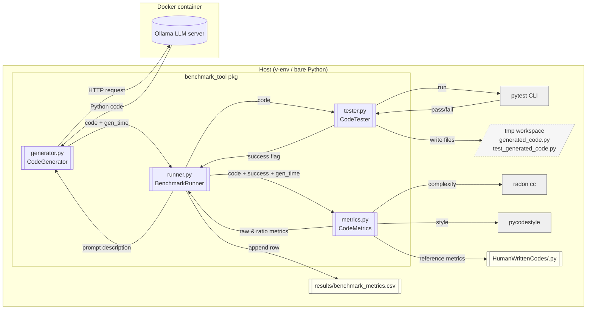

# mermaid_chart_benchmark_tool.md

```mermaid
flowchart LR
    %% ==========  ZONES  ==========
    subgraph HOST["Host (v-env / bare Python)"]
        direction TB
        subgraph bench["benchmark_tool pkg"]
            CG[[generator.py<br/>CodeGenerator]]
            CT[[tester.py<br/>CodeTester]]
            CM[[metrics.py<br/>CodeMetrics]]
            RN[[runner.py<br/>BenchmarkRunner]]
        end
        PyT[pytest CLI]:::tool
        TMP[/tmp workspace\n generated_code.py<br/> test_generated_code.py/]:::tmp
        Radon[radon cc]:::tool
        PEP8[pycodestyle]:::tool
        REF[[HumanWrittenCodes/<task>.py]]:::art
        CSV[[results/benchmark_metrics.csv]]:::art
    end

    subgraph DOCKER["Docker container"]
        LLM[(Ollama LLM server)]
    end

    %% ==========  FLOW  ==========
    RN --"prompt description"--> CG
    CG --"HTTP request"--> LLM
    LLM --"Python code"--> CG
    CG --"code + gen_time"--> RN

    RN --"code"--> CT
    CT --"write files"--> TMP
    CT --"run"--> PyT
    PyT --"pass/fail"--> CT
    CT --"success flag"--> RN

    RN --"code + success + gen_time"--> CM
    CM --"style"--> PEP8
    CM --"complexity"--> Radon
    CM --"reference metrics"--> REF
    CM --"raw & ratio metrics"--> RN
    RN --"append row"--> CSV

    %% ==========  STYLES  ==========
    classDef tool fill:#EFEFEF,stroke:#666
    classDef art  fill:#FFFFF0,stroke:#777
    classDef tmp  fill:#F6F6F6,stroke:#999,stroke-dasharray:3 3
```
