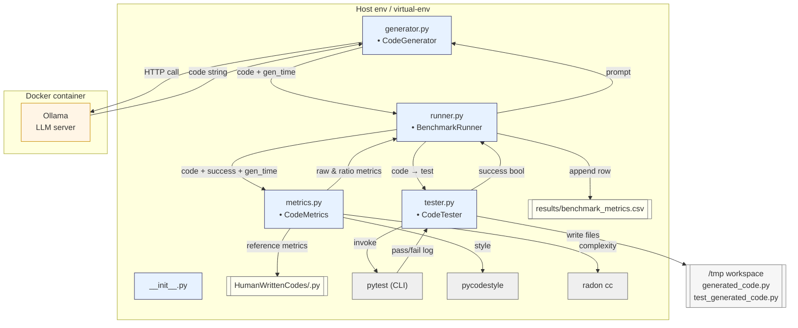

# Benchmarking Tool Diagram

```mermaid
flowchart TD
    %% ──────────────────  PACKAGE ON HOST  ──────────────────
    subgraph Host_Python["Host env / virtual‑env"]
        direction TB

        CG[generator.py<br/>• CodeGenerator]:::file
        CT[tester.py<br/>• CodeTester]:::file
        CM[metrics.py<br/>• CodeMetrics]:::file
        RN[runner.py<br/>• BenchmarkRunner]:::file
        INIT[__init__.py]:::file

        REF[[HumanWrittenCodes/<task>.py]]:::data
        CSV[[results/benchmark_metrics.csv]]:::data

        PyT["pytest (CLI)"]:::hosttool
        PEP8["pycodestyle"]:::hosttool
        Radon["radon cc"]:::hosttool
    end

    Temp[[/tmp workspace<br/>generated_code.py<br/>test_generated_code.py]]:::tmp

    %% ──────────────────  DOCKER  ───────────────────────────
    subgraph Docker["Docker container"]
        LLM[Ollama<br/>LLM server]:::docker
    end

    %% ──────────────────  FLOW  ─────────────────────────────
    RN -- "prompt" --> CG
    CG -- "HTTP call" --> LLM
    LLM -- "code string" --> CG
    CG -- "code + gen_time" --> RN

    RN -- "code → test" --> CT
    CT -- "write files" --> Temp
    CT -- "invoke" --> PyT
    PyT -- "pass/fail log" --> CT
    CT -- "success bool" --> RN

    RN -- "code + success + gen_time" --> CM
    CM -- "style" --> PEP8
    CM -- "complexity" --> Radon
    CM -- "reference metrics" --> REF
    CM -- "raw & ratio metrics" --> RN

    RN -- "append row" --> CSV

    %% ──────────────────  STYLE DEFINITIONS  ────────────────
    classDef file     fill:#E7F2FF,stroke:#336,stroke-width:1px;
    classDef docker   fill:#FFF5E6,stroke:#C88A00,stroke-width:1px;
    classDef tmp      fill:#F6F6F6,stroke:#888,stroke-dasharray:3 3;
    classDef data     fill:#FFFFF0,stroke:#777,stroke-width:1px;
    classDef hosttool fill:#EFEFEF,stroke:#666,stroke-width:1px;
```
